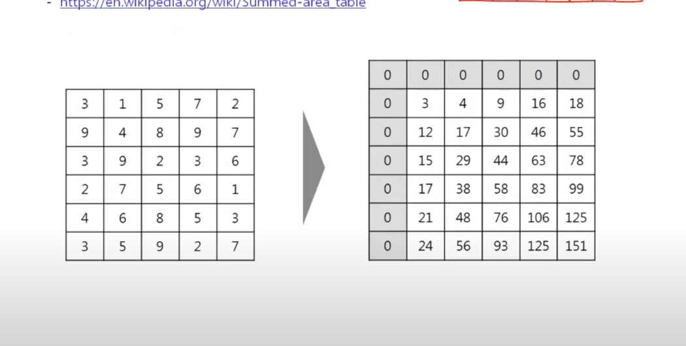
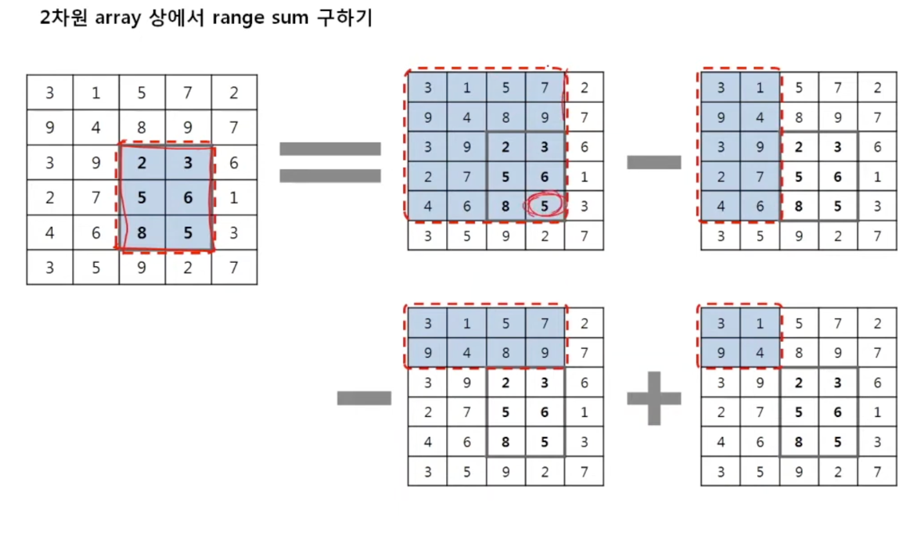
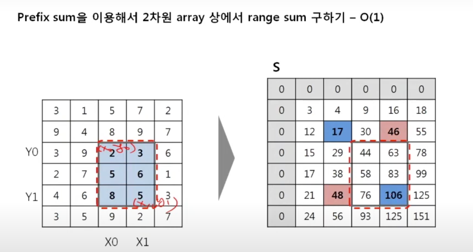

## 풀이

https://www.acmicpc.net/problem/20002

- 2차원 배열 누적합에 대한 개념이 없어서 머리가 깨질뻔했다. 강의 영상을 보면 개념 이해가 빠르게 된다. (https://www.youtube.com/watch?v=KT864Aa3zE0)

- 아래처럼 2차원 누적합 배열을 생성한다.


- 부분구간합을 구하는 방법은 아래그림과 같다.
- 총 누적합에서 해당하지 않는 구간을 빼준다.
- 해당하지 않는 구간중 겹치는 부분은 두 번 빼기 때문에 겹치는 부분을 한 번 더해주면 된다.


- 즉 아래의 인덱스위치의 값들을 계산해주면 된다.



- 20002번 사과나무 문제는 이 2차원 배열 누적합의 기본적인 문제다. 우린 최대값을 찾아야 하기 떄문에 정사각형 모양의 모든 구간합을 알아야한다.
- 아래처럼 3중 for문으로 i * i 크기의 정사각형 부분구간합을 구해주면서 최대값을 갱신해주는 풀이 방법이다.
```java
        //i * i 만큼의 부분구간합을 구하는 과정이다. 누적합 배열에서 Description의 그림과 같이 부분구간합을 구해서 최댓값 비교를 한다.
        for (int i = 1 ; i <= n ; i++) {
            for (int r = i ; r <= n ; r++) {
                for (int c = i ; c <= n ; c++) {
                    max = Math.max(max, sumMap[r][c] + sumMap[r - i][c - i] - sumMap[r - i][c] - sumMap[r][c - i]);
                }
            }
        }
```