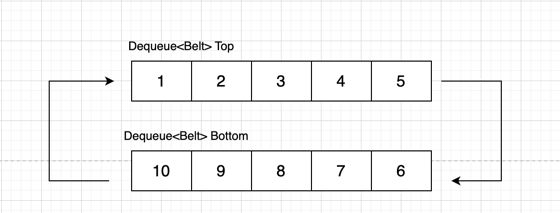
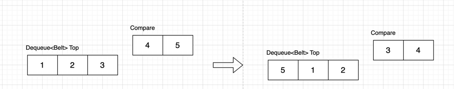

## 풀이
https://www.acmicpc.net/problem/20055

### 흐름
1. 컨베이어 벨트 구현을 고민해보니 덱을 사용하면 쉽게 구현할 수 있을것 같았다.
2. top bottom 두 개의 덱으로 문제 조건에 맞는 함수들을 구현해 진행했다.
3. 생각해보니 bottom은 그냥 큐로 구현해도 문제 없을것같다.

### 구현

- top, bottom 두 개의 덱으로 topLast 를 bottomLast에, bottomFirst를 topFirst에 삽입해주며 회전을 구현한다.

- 로봇이 움직이는 과정은 top에서 마지막 두개의 원소들을 비교해주면서 구현한다.

- 위 과정을 반복하며 정답을 찾는다.