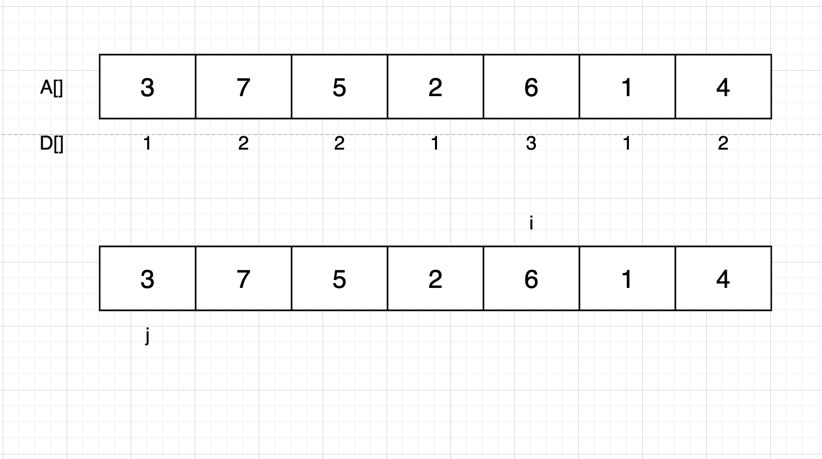

## 풀이

- 마땅한 풀이를 생각해 내지 못한 내 자신. 반성하자 
- 이 문제는 가장 긴 증가하는 부분 수열(Longest Increasing Subsequence) 문제다.
- 간단하다. 증가하는 부분수열의 원소들은 정렬할 필요가 없으니 전체 배열의 길이에서 LIS를 빼주면 된다.
- 아래는 LIS를 구하는 과정 풀이이다.

- 나열된 숫자들(A[]) 자신의 가장 긴 증가하는 부분수열 값(D[])을 갖고있다.
- D[i]를 구하는 방법은 이렇다 j를 0부터 i까지 순회시키며 각 A[j] < A[i]를 만족하면서 D[j] + 1이 D[i] 보다 큰 수가 있다면 D[i]에 D[j] + 1을 삽입한다.
- 근거는 D[j] 까지의 가장 긴 부분 수열 값이 있을때 뒤에 나타나는 A[j] 보다 큰 A[i]의 D[i] 값은 반드시 D[j] 보다 1이 크기 때문이다.


- 코드.

```java
        for (int i = 0 ; i < n ; i++) {
            d[i] = 1;
            for (int j = 0 ; j < i ; j++) {
                if (arr[j] < arr[i] && d[i] < d[j] + 1) {
                    d[i] = d[j] + 1;
                }
            }
        }
```