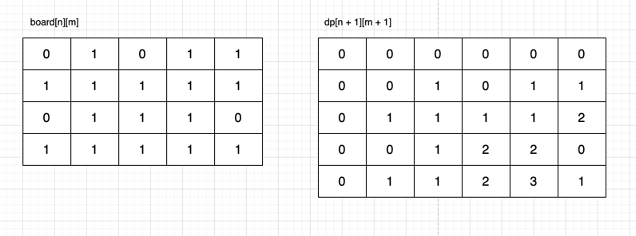
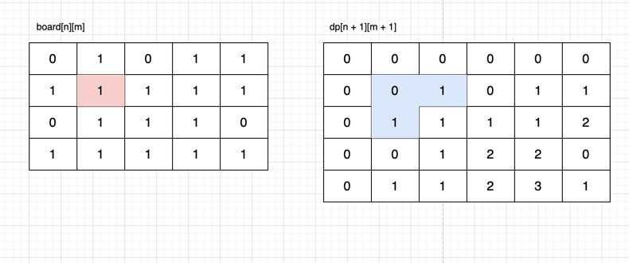
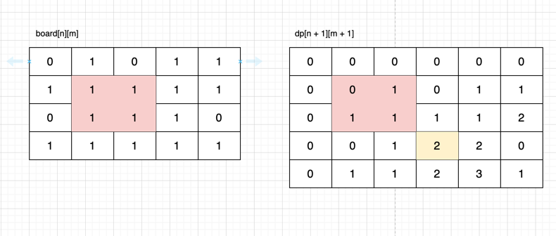
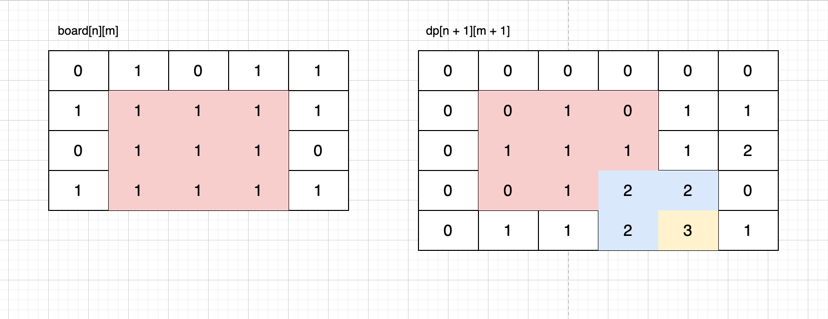

## 풀이
https://www.acmicpc.net/problem/4095

- 입력값을 보면 딱 DP문제인게 보인다.
- 프로그래머스에 같은 문제가 있는데 또 못풀었다. 정사각형 변의 길이를 구하는 방식을 도출하지 못하면 못푸는 문제다.
- (n + 1) * (m + 1) 너비의 DP배열을 선언하고 정사각형이 성럽하는 구간의 오른쪽 하단에 변을 기록하는 방식이다.

```java
//좌측 대각선 상단이 1이라면 dp배열의 상단, 좌측, 죄대각 값의 최소값 + 1을 기록해준다.
for (int i = 1 ; i <= n ; i++) {
        for (int j = 1 ; j <= m ; j++) {
          if (board[i - 1][j - 1] == 1) {
            int min = Math.min(Math.min(map[i - 1][j],map[i][j - 1]), map[i - 1][j - 1]);
            map[i][j] = min + 1;

            max = Math.max(max, map[i][j]);
          }
        }
      }
```

- 아래 그림을 보자
- 왼쪽 주어진 배열에 대해 dp배열을 생성한 결과다.


- 과정을 보면 대각선이 1일때 dp배열의 파란색 부분의 최소값 + 1 을 현재 인덱스 값에 대입한다.



- 즉 정사각형 최대 변의 길이는 아래 노란 위치에 나타나게 된다. 



- 결과를 보면 이렇다. 빨간색 정사각형의 변의 길이는 노란색에 결과가 나오고 파란부분의 최솟값 + 1 인걸 확인할 수 있다.

