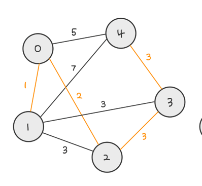

## 핵심

---

최소 신장 트리   
크루스칼 알고리즘   
Union Find 

### 최소 신장 트리 (Minimum spanning tree)   
무방향 가중치 그래프에서 최소 가중치로 모든 노드를 연결한 트리

[참고 링크 (맷돌 로그)](https://maetdori.tistory.com/entry/%EC%95%8C%EA%B3%A0%EB%A6%AC%EC%A6%98-Minimum-Spanning-Tree-MST-%EC%B5%9C%EC%86%8C-%EC%8B%A0%EC%9E%A5-%ED%8A%B8%EB%A6%AC?category=857970)

### 크루스칼 알고리즘   
간선을 기준으로 그래프를 그리는 알고리즘   
최소 간선을 선택 -> 노드 연결

### Union Find   
그래프에 대표 노드를 설정, 하나의 합집합으로 묶는 것

모든 노드들이 자신이 속해있는 그래프의 대표 노드를 바라보도록